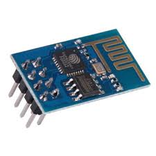
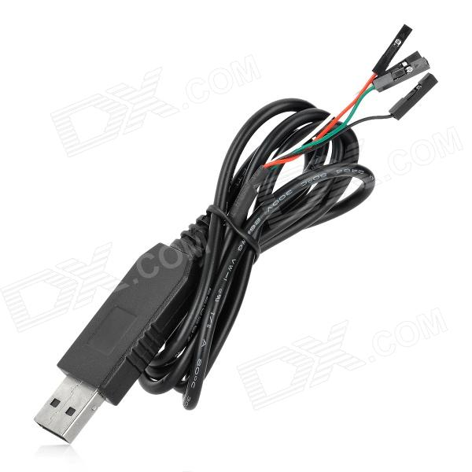
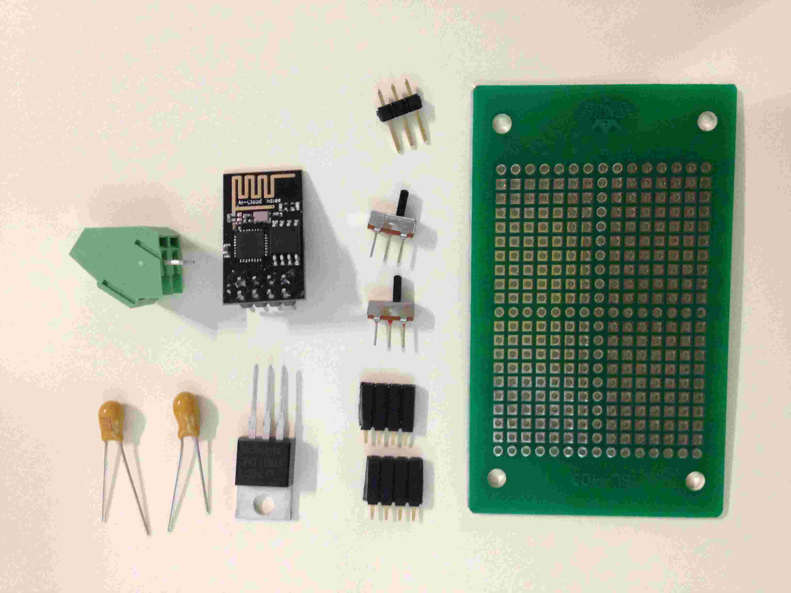
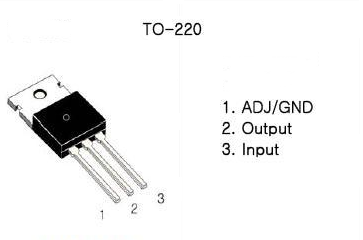
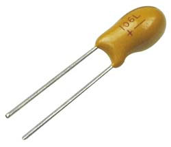
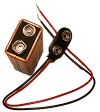
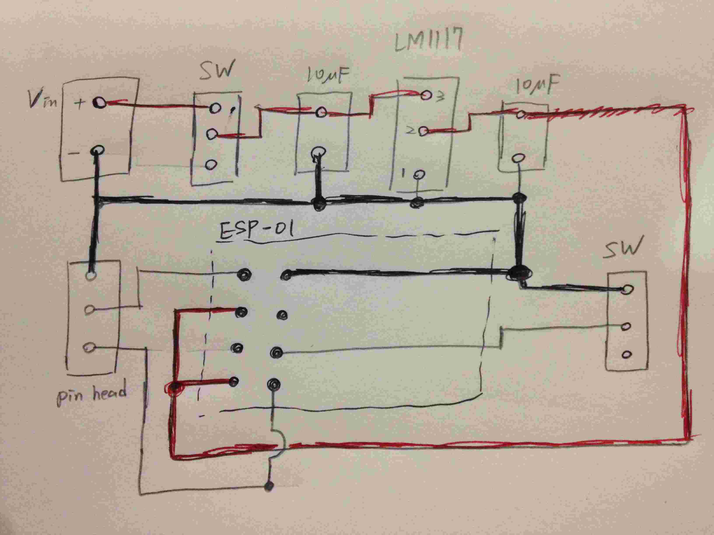
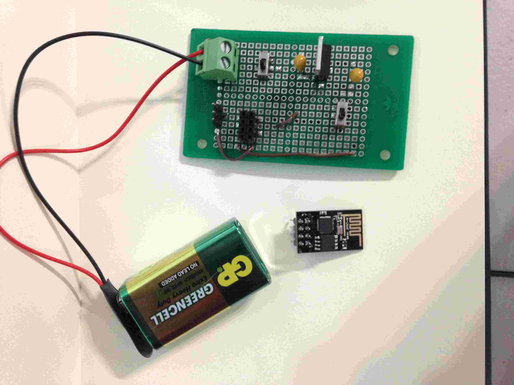
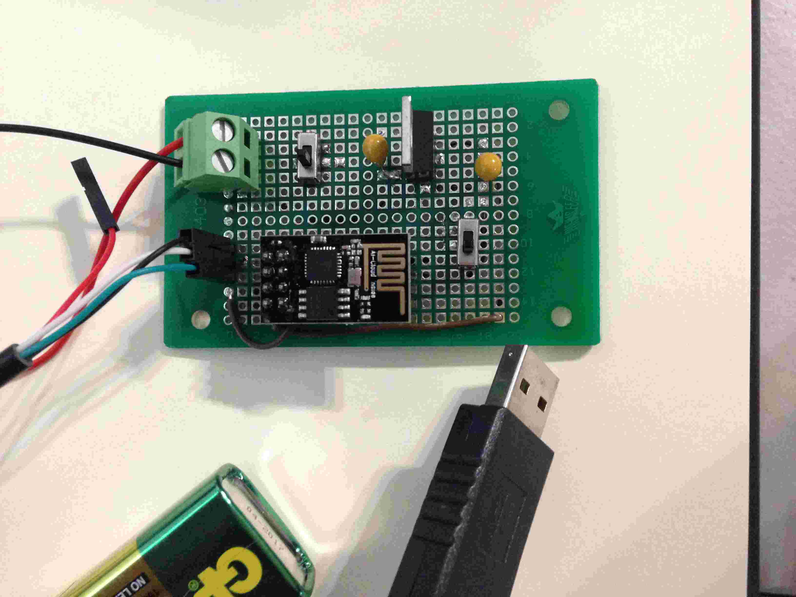

# ESP8266 wifi 通訊模組韌體燒錄簡介

ESP8266是一款具有 WiFi 通訊功能的 MCU 晶片，被拿來組合成各種五花八門的模組板，其中最常見也最容易買到的模組型號就 ESP-01，尺寸迷你價格便宜，而且通常網路店家出貨的時候就已經安裝好韌體，讓一般使用者可以透過 UART 介面下指令給 ESP8266 來連結WiFi網路。

此篇文章進行燒錄 ESP模組 是使用Linux 平台(Raspberry Pi2 with Raspbian-jessi) 為實作平台。

## 硬體設置

市面上的ESP8266模組到手的時候，預設應該是可以透過模組上的 Tx/Rx (UTXD/URXD) pin腳來下 AT command 進行簡單的 WiFi 連線。但要利用電腦控制 ESP8266 模組之前要先搞定硬體設置的問題，也就是線怎麼接，要餵什麼電源? 

開發的過程之中，常常會在燒錄模式和一般模式之間切換。如果用麵包板來玩的話，會搞的手忙腳亂。所以我們這邊製作一片轉接板方便我們控制ESP8266模組

### 材料清單

- ESP-01 模組
- USB-UART 轉接線
- 洞洞板一片
- 鉭質電容x2
- 三針 pin 腳 x 1
- 四針 pin 腳座 x 2 
- 滑動開關 x 2
- LM1117 電晶體 x 1
- 電線若干長...

#### ESP-01 模組

要玩ESP8266一定要買個模組，露天上面很好買，價格也超便宜。

#### USB-UART 轉接線  

一般使用可以簡單買到如下圖的 USB-UART 轉接線(也叫 USB-TTL 轉接線)和ESP模組連接，一百台票左右就買得到。

  

這種轉接線大都有四條不同顏色的線，定義如下:  

- 紅色 : +5V 電源  
- 黑色 : 接地 (GND)
- 綠色 : TX 線
- 白色 : RX 線

接上電腦之後如果作業系統是使用 Linux (這邊以Raspberry Pi的 Raspbian 為例)，會在系統目錄 /dev/ 之上出現 ttyUSB0 。然後就可以直接用 minicom 之類的程式透過這個系統裝置檔來和它溝通。

#### 其他材料

剩下懶得打了，直接看下面的圖。

通通可以在電子材料行買到。

## 電路圖 

USB-UART 轉接線的USB接電腦。然後 USB-UART 轉接線上的黑色、綠色、白色線要拿來和ESP-01 模組連接。可以看到模組上有八根沒有標示的 pin 腳。上網查了一下，可以知道 pin 腳配置如下:

而 USB-UART 轉接線和 ESP-01 模組的接法，以及其他腳位的接法如下:

    ESP8266 pin:
    GND -----> 接地...
    UTxD ----> RxD (USB-UART 轉接線:白色)
    GPIO_2 --> 不用接
    CH_PD ---> 3.3V (要另外接電源，不能直接接轉接線的 +5V 會燒掉)
    GPIO_0 --> 不要接!! (不接的時候為一般使用模式，接地則為刷韌體模式)
    RST -----> 不用接
    URxD ----> TxD (USB-UART 轉接線:綠色)
    VCC -----> 3.3V (要另外接電源，不能直接接轉接線的 +5V 會燒掉)
    
    電流需求 : 200 ~ 300 mA

這邊要注意的地方是 ESP-01 模組的 GPIO\_0 腳位，該腳位不接任何東西的時候為一般使用模式，當要透過UART介面燒韌體進去的時候要把 GPIO\_0 腳位接地。使用 UART 做通訊的時候記得要設定連線設定如下: (115200 8N1)

- Baudrate:115200
- byte size: 8
- Parity: None
- Stop Bit: 1

### 注意ESP8266的電源問題

ESP-01 模組對於電源電流供應會有一些要求，如果電源不夠力的話，會導致模組運作不穩定。不建議用 Raspberry Pi 板子來供電，因為 Pi 板是吃 USB 給電的，有時候 Pi 板自已吃都不夠力了，還要分 200~300mA 給 ESP-01 模組，這樣會讓整個系統都不太穩定。

所以這邊建議另外搞一個直流電源供電給 ESP-01 模組。除了使用市面上的電源供應器之外，考慮到 ESP-01 模組會裝在一台遙控車上面跑，可以用電池透過直流電源模組來單獨供電給 ESP-01 模組。這邊的做法是去買一個 LM1117 IC (3.3v)、兩個電容、一片洞洞板來自行做一個，還可以順便把 ESP-01 模組整合在一起。(當然可以先用麵包板驗證一下電路) 

LM1117 3.3v 的 IC 長這樣:(跟電子材料行買的時候記得要說清楚，是要 "3.3V" 的)

而 LM1117 電路圖接法如下:

裡面的電容就買這種的(10uF):

電路燒好之後，就用這種 DC9V 的方形電地加上，鈕扣接頭。

9V 電源從 LM1117 的 VIN 端(PIN 3)接進去就行。然後從 VOUT 端(PIN 2)就可以量到 3.3V 了。

### 轉接板線路圖

整個傳接板的電路簡圖大略如下。SW是滑動開關，10uF的地方是電容，pin head 的地方是三針針腳用來和 USB-UART 轉接線連接，而兩個四針的針腳座是給ESP-01模組連接用的。

拿出焊槍經過一番努力之後的完成圖:

把 ESP-01 模組和 USB-UART 接上去:  

上面的開關用來切換電源，下面的開關用來切換"一般使用模式"和"燒錄韌體模式"。

## 使用 ESPlorer 和 ESP-01 模組進行溝通

在和 ESP8266 溝通通常是用 ESPlorer 這一套用 java 寫的 IDE 軟體，可以到下面網址下載:

[http://esp8266.ru/esplorer/](http://esp8266.ru/esplorer/)

下載到 Raspberry Pi 之後解壓縮進去資料夾，可以看到一個 ESPlorer.jar 的檔案。這時可以下 java 指令去執行它:

    > sudo java -jar ESPlorer.jar

要用 sudo 是因為，存取 /dev/ttyUSB0 會需要使用管理者權限。成功執行之後會看下面的開發畫面，此時可以透過右上角用紅色方塊圈起來的地方設定 UART 連線設定。

我們把 USB-UART 轉接線接上 Raspberry Pi ，然後按下那個紅色框框裡面的那個藍色圈圈按鈕掃描現在所有的 serial port 應該就會出現選項 "/dev/ttyUSB0" 選取之後，把 baudrate 改為 115200 、USB-UART 轉接線和ESP8266模組的 UART port 接好。

準備好之後按下 Open 的按鈕就會開始連線。這個時候可以用左邊畫面上的 "AT v0.20" 的頁面，裡面把許多 AT command 整理成按鈕的功能。這樣子就不用一直查AT command 表了。 

## 燒錄韌體 nodeMCU

ESP8266是可程式化的通用微控制器(具有WiFi功能)，具有少數的 GPIO。ESP-01模組上只拉出兩根。而從拍賣網站上買到手的時候，裡面其實已經燒好最新版本的韌體來支援 AT command。網路上也流傳著許多其他版本的韌體來支援其他功能，像是較為知名的支援可在模組上執行 Lua 程式語言的韌體(nodeMCU)，其原始碼就放在[github](https://github.com/nodemcu/nodemcu-firmware/)上。不過要自行編譯原始碼的話會是一項大工程，所幸的是，有網站提供客製化的 nodeMCU 韌體線上編譯的免費服務，網址為

[http://frightanic.com/nodemcu-custom-build/](http://frightanic.com/nodemcu-custom-build/)

編譯好的韌體會傳送到網頁上要求輸入的 email 位址，筆者收到了兩個檔案:
    
    nodemcu-master-7-modules-2015-09-18-02-26-58-float.bin
    nodemcu-master-7-modules-2015-09-18-02-26-58-integer.bin

燒錄的時候，我是選檔案大小比較小的那個。拿到韌體之後，我們還需要一個燒錄程式，在這邊我是使用 [esptool.py](https://github.com/themadinventor/esptool) 這個指令工具，下載安裝之後。就可以準備開始燒錄韌體了。

### Raspberry Pi Raspbian 上安裝 esptool

    ## 如果沒有安裝python-dev 套件的話記得先安裝
    > sudo apt-get install python-dev
    
    ## 然後下載安裝esptool
    > git clone https://github.com/themadinventor/esptool.git
    > cd esptool
    > sudo python setup.py install

進行燒錄時使用下面所示的接線配置，可以使ESP模組進入燒錄模式，

- CH_PD --> 3.3v  
- VCC   --> 3.3V  
- UTXD  --> RXD (USB-UART 轉接線:白色)  
- URXD  --> TXD (USB-UART 轉接線:綠色)  
- GPIO0 --> GND <重點>  
- GND   --> GND  

如果有自行焊好轉接板的話，就只要把下面的開關往上撥，就會轉換成燒錄模式(GPIO_0接地)，然後上面的開關是電源開關...。接好線之，把 USB-UART 轉接線接上Pi 系統會自動跳出裝置檔檔名

    /dev/ttyUSB0

然後打開 command-line ，移動到存有nodemcu bin 檔的目錄，然後使用 esptool.py 指令:
        
    sudo esptool.py --port /dev/ttyUSB0 write_flash 0x000000 nodemcu-master-7-modules-2015-09-18-02-26-58-integer.bin

接著就會出現燒錄中的訊息，會需要一點點時間:

    pi@raspberrypi ~ $ esptool.py --port /dev/tty.usbserial write_flash 0x000000 nodemcu-master-7-modules-2015-09-18-02-26-58-integer.bin
    Connecting...
    Erasing flash...
    Wrote 354304 bytes at 0x00000000 in 34.6 seconds (82.0 kbit/s)...

    Leaving...
    onionys$

如此一來，就完成燒錄的工作了。重新接線後，會發現 AT command 已經不能使用了。之後，我們會再介紹如何在 nodeMCU 的韌體下使用 Lua 語言控制 ESP8266 模組。

如果之後想再把那個 AT command 的韌體燒回來，也是用一樣的方法。下面的連結有 AT command 的韌體: 
[http://dominicm.com/flash-esp8266-wi-fi-module-firmware/](http://dominicm.com/flash-esp8266-wi-fi-module-firmware/)  

# 使用 ESPlorer 寫 Lua 程式言語控制ESP8266

打開 ESPlorer ，UART 的連線速度改為 9600。 ESP8266 切換回去一般模式(GPIO\_0 不接地) 然後等ESPlorer 按下 "Open" 之後再打開ESP8266 的電源。此時就會看到韌體的版本訊息，之後就可以開始寫程式了。

使用左半邊視窗的 "NodeMCU+MicroPython" 的頁面，就可以開始編寫 lua code了。寫完code之後，按下下面的按鈕 "Send to ESP"，就會看到所編寫的程式碼被以送一行 code 執行一行code 的方式送到 ESP8266模組裡面執行。

把所有的 code 寫好之後，按下"Save"的按鈕，整包 code 就會以檔案的方式存到ESP8266 的記憶體之中。ESP8266 會在開機之後就自動執行init.lua 這個檔案，所以如果有什麼事是要在ESP8266開機後馬上執行的，就把檔名命名為 init.lua。

下面是 nodeMCU 所提供的 Lua API 查詢網頁:

[lua api reference for nodemcu](https://github.com/nodemcu/nodemcu-firmware/wiki/nodemcu_api_en)

# Lua Project: wifi-serial bridge

下面的 lua code 是為了把 motoduion 經由 UART port 傳出來的封包透過 Wi-Fi 的形式傳送給 Raspberry Pi。  
因為是使用UDP/IP 的形式傳送，所以 Raspberry Pi 那邊要實作一個 udp socket 程式來接收封包。  

## init.lua

    print("ESP8266 START")
    
    ssid = "My_AP"  # 要連接的 Wi-Fi AP 主機名稱 
    passwd = "12345678"  # AP 連線密碼
    scratch_ip = "192.168.0.1" # raspberry pi 主機的 IP
    scratch_port = 12345  # IP的 Port number
    
    wifi.setmode(wifi.STATION)
    wifi.sta.config(ssid,passwd,1)
    
    tmr.alarm(1,1000, 1, function() 
        if wifi.sta.getip()==nil then 
            print(" Wait to IP address! for " .. ssid) 
        else 
            print("New IP address is "..wifi.sta.getip())
            tmr.stop(1)
            sck = net.createConnection(net.UDP)
            sck:on('receive', function(sck,pl) uart.write(0,pl) end)
            uart.on('data',0, function(data) sck:send(data) end,0)
            sck:connect(scratch_port,scratch_ip)
            sck:send("START UART Tunnel\n")
            uart.setup(0,38400,8,0,1,0)
        end 
    end)
    
    print(wifi.sta.getip())

## main.lua

    print("START to change 38400")
    uart.setup(0,38400,8,0,1,0)
    print("START 38400 baudrate")
    print("uart restart")
    sck = net.createConnection(net.UDP)
    sck:on('receive', function(sck,pl) uart.write(0,pl) end)
    uart.on('data',0, function(data) sck:send(device_id .. data) end,0)
    sck:connect(scratch_port,scratch_ip)

## Reference

[參考教學網頁](http://blog.squix.ch/2014/12/esp8266-flashing-lua-firmware-and.html)

[線上 build codeMCU (Lua) 的網頁](http://frightanic.com/nodemcu-custom-build/)

[esptools.py的github](https://github.com/themadinventor/esptool)

[NodeMCU 官網](http://nodemcu.com/index_en.html)

[ESPLorer IDE 需Java7DevKit](http://esp8266.ru/esplorer/)
