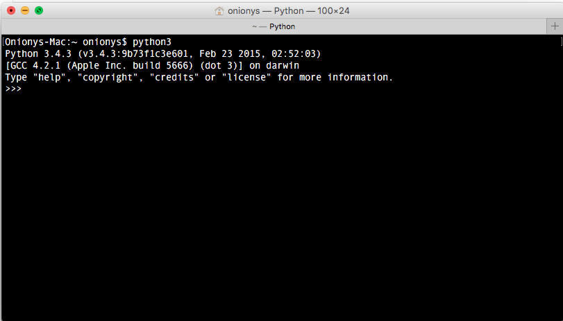
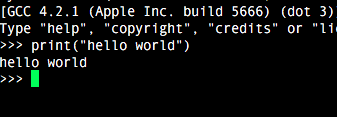

# 前言

Python 是一個很有趣的高階程式言語，易學易用。即使不用學得很深就可以開始開發一些好動好玩的程式碼。想當初開始學python的契機是在當菸酒生時想要用程式碼來做科學計算時，因為不想用matlab 或是mathematica 這類的軟體來做，才在強者級學弟的建議之下開始了python+numpy的學習之旅。

當時可沒感覺到python有多好學...那是因為我是非CS本科的啦。所以在沒底的情況之下，又找不到人問的情況下邊摸邊學的關係。而當時島上比較流行的是Ruby。而市面上的入門書又非常非常的少，連書架上歐社的書都只有幾本針對中高階程度的人的書。

不過最近Python流行起來之後被視為程式設計學習入門的第一選擇，而Python各層面的書幾乎是一個星期就出一本，有入門有高階，這實在是當年所無法想像的。

python前一陣子的時候發生了一件相當於"英雄內戰"的情形發生，原因在於python的語法進版，由2進到3。而這次的改版在很多地方做出算是大刀闊斧的改變，而使得一些已經習慣舊版的人很不習慣。不過對於初學者而言，還是直接就學最新的版本吧。目前最新的版本是3.5。而這系列的文章都是以3.5最準。

## 安裝

python 在linux和mac os x兩個系統上算是預設就裝好的，而且如果這兩個系統都是用最新版的話，那預設應該就是最新版的。如果不是的話，那就去python官方網站download 下來安裝吧。

https://www.python.org/

但是如果是用win系統的話，預設是沒有的。而建議用 anaconda 這個東西來進行安裝會比較省心省事。

https://www.continuum.io/downloads

這部份先寫到這，之後再說。

## 執行python直譯器

python的程式碼都是以單純的文字檔格式儲存下來的，要執行這些文字形式的程式碼時，其實是先執行一個叫做 python 或 python3 的執行檔去讀取程式碼後一行行的執行下去。

所以先來玩玩python 的直譯器吧。先打開command line執行環境。然後執行 python 指令，但是如果版本顯示python2.7xxx左右，那就執行 python3 試看看。像我的mac os x 是較舊的，所以要執行python3。如下圖。

如圖所示，在那個 ">>>" 符號之後就可以開始打python的程式碼了。

 
## hello world

先來在螢幕上面顯示個"hello world"吧，鍵入以下內容:

    >>> print("hello world") 

然後按下enter鍵後，就會看到螢幕印出 hello world 的字樣，如下圖。

這篇就先講到這邊，之後看能不能之後較有空的時候再來寫玩整一點(看心情?)。接下來進入part2 基本資料結構的部份。